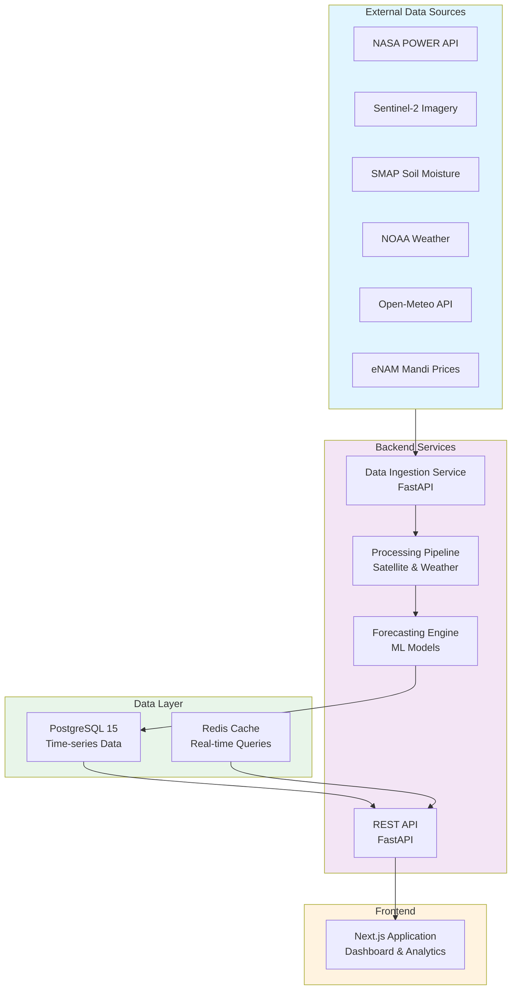

# AgriPulse Intelligence

**Satellite-Powered Crop Demand Prediction for India's Agri-Input Industry**

[](https://opensource.org/licenses/MIT)
[](https://www.python.org/)
[](https://fastapi.tiangolo.com/)
[](https://nextjs.org/)
[](https://www.postgresql.org/)

## Problem Statement

India's agri-input companies lose **₹500 Cr+ annually** due to inventory misallocation and demand forecasting failures. Sales representatives operate without real-time crop health intelligence, leading to:

- Excess stock in regions with declining crop viability
- Stockouts in high-demand territories
- Inefficient allocation of agronomic support
- Missed opportunities in precision agriculture

## Solution

AgriPulse Intelligence combines **real-time satellite imagery, meteorological data, and market intelligence** to provide predictive demand signals for crop inputs:

- **Satellite Data**: NDVI (vegetation index), soil moisture (SMAP), vegetation health (VHI)
- **Weather Integration**: Temperature, rainfall, wind patterns via NOAA/Open-Meteo
- **Market Intelligence**: Mandi prices, commodity trends, pest outbreak alerts
- **AI-Powered Forecasts**: 7-day, 30-day, seasonal demand predictions by crop and district

## Architecture Overview



## Target Personas

### 1. Agri-Input Sales Representatives
**Rajesh** — District sales head for fertilizer company
- Manages 2,000+ farmer accounts across district
- Makes weekly allocation decisions
- Needs: Crop-wise demand forecasts, weather alerts, competitive pricing

### 2. District Agricultural Officers
**Dr. Priya** — Government extension officer
- Advises 50,000+ farmers on input use
- Reports to state agricultural department
- Needs: Seasonal crop health data, soil recommendations, yield benchmarks

### 3. Cotton Traders & Ginners
**Vikram** — Commodity trader in Vidarbha region
- Forecasts input demand to manage working capital
- Coordinates with farmers and input suppliers
- Needs: Region-wide crop health scores, mandi trends, yield estimates

### 4. Smallholder Farmers
**Balu** — 2-hectare cotton farmer
- Optimizes input purchases based on field conditions
- Limited mobile data access
- Needs: Field-level crop health, cost-benefit recommendations, SMS alerts

## Technology Stack

| Layer | Technology |
|-------|-----------|
| **Frontend** | Next.js 14, React 18, TypeScript, Tailwind CSS, Recharts |
| **Backend** | FastAPI, Python 3.11, Pydantic, SQLAlchemy |
| **Database** | PostgreSQL 15, TimescaleDB extension (time-series) |
| **Satellite APIs** | NASA POWER, Sentinel-2, MODIS, NOAA VHI, SMAP |
| **Weather APIs** | Open-Meteo, NOAA GFS |
| **Market Data** | eNAM API, CAI reports, Agricultural Statistics Division |
| **DevOps** | Docker, Docker Compose, GitHub Actions, PostgreSQL 15-Alpine |
| **ML** | Scikit-learn, XGBoost, Prophet (forecasting) |

## Quick Start

### Prerequisites
- Docker & Docker Compose (latest)
- Git

### Installation & Running

```bash
# Clone the repository
git clone https://github.com/yourusername/agripulse-app.git
cd agripulse-app

# Copy environment template
cp .env.example .env

# Start all services (postgres, backend, frontend)
docker-compose up -d

# Initialize database with Vidarbha pilot data
docker-compose exec backend python scripts/seed_data.py

# Access the application
# Frontend: http://localhost:3000
# Backend API: http://localhost:8000
# API Docs: http://localhost:8000/docs
```

### Development Setup

```bash
# Backend (local development with hot-reload)
cd backend
python -m venv venv
source venv/bin/activate
pip install -r requirements.txt
uvicorn app.main:app --reload

# Frontend (in separate terminal)
cd frontend
npm install
npm run dev
```

## Project Structure

```
agripulse-app/
├── backend/                    # FastAPI application
│   ├── app/
│   │   ├── main.py           # Entry point
│   │   ├── api/              # Route handlers
│   │   ├── services/         # Business logic
│   │   ├── models/           # SQLAlchemy models
│   │   ├── schemas/          # Pydantic schemas
│   │   └── clients/          # External API clients
│   ├── scripts/
│   │   └── seed_data.py      # Database initialization
│   ├── tests/
│   ├── requirements.txt
│   └── Dockerfile
├── frontend/                   # Next.js application
│   ├── app/
│   │   ├── page.tsx          # Home page
│   │   ├── dashboard/        # Dashboard routes
│   │   └── layout.tsx        # Root layout
│   ├── components/           # React components
│   ├── public/               # Static assets
│   ├── package.json
│   └── Dockerfile
├── docs/                      # Documentation
│   ├── PRD.md               # Product requirements
│   ├── ARCHITECTURE.md      # System design
│   └── SATELLITE_RESEARCH.md
├── .github/
│   ├── workflows/
│   │   ├── ci.yml           # Continuous integration
│   │   └── deploy.yml       # Deployment pipeline
│   └── ISSUE_TEMPLATE/
├── docker-compose.yml
├── .env.example
├── .gitignore
├── LICENSE
└── README.md
```

## Key Features (MVP)

### Dashboard
- Real-time crop health visualization by district/taluqa
- Weather alerts and forecasts
- Mandi price trends and analysis

### Demand Intelligence
- 7-day and 30-day input demand forecasts
- Crop-wise and region-wise breakdowns
- Confidence intervals and prediction rationale

### Data Integration
- Live NASA POWER satellite data (NDVI, temperature, humidity)
- NOAA weather forecasts
- eNAM mandi prices (updated daily)
- Pest outbreak alerts (integration pending)

### Reporting
- Weekly demand reports by crop and region
- Exportable as PDF/CSV
- Distribution via email/SMS for field teams

## Pilot Deployment

**Territory**: Vidarbha region, Maharashtra
- **Districts**: Akola, Amravati, Buldhana, Washim, Yavatmal
- **Pilot Users**: 15 agri-input sales reps (5 companies)
- **Data**: 7 years historical cotton yields (CAI), real-time satellite imagery

## Success Metrics

| Metric | Target | Timeline |
|--------|--------|----------|
| Pilot user adoption | 15 active users | Week 2 |
| Weekly active engagement | 80% of users | Week 4 |
| Demand forecast accuracy | >70% (MAE < 10% of mean) | Week 6 |
| Integration stability | 99.5% API uptime | Ongoing |
| Satellite data latency | <4 hours (NASA POWER) | MVP |

## Market Opportunity

- **Total Addressable Market**: India's ₹8B agri-input market
- **Target Segment**: B2B (input companies) + Government extension + Commodity traders
- **Primary User Base**: 14M cotton farmers in India
- **Pilot Focus**: Vidarbha region (₹2,500Cr annual input consumption)

## Competitive Landscape

| Solution | Target | Differentiator | Positioning |
|----------|--------|---|---|
| **Farmonaut** | Smallholder farmers | Field-level imagery | Consumer play |
| **CropIn** | Large enterprises | Yield management | High-touch enterprise |
| **SatSure** | Lenders | Collateral valuation | Risk management |
| **AgriPulse** | Input companies | B2B demand prediction | **Demand intelligence** |

## Data Privacy & Security

- GDPR-compliant data handling
- PostgreSQL encryption at rest
- API authentication via JWT tokens
- No storage of personal farmer PII without consent
- All external API integrations validated and logged

## API Documentation

Full OpenAPI/Swagger documentation available at:
```
http://localhost:8000/docs
```

### Key Endpoints

- `GET /api/v1/satellite/ndvi` — Current NDVI values by district
- `GET /api/v1/forecasts/demand` — 7/30-day demand predictions
- `GET /api/v1/weather/alerts` — Active weather and pest alerts
- `GET /api/v1/mandi/prices` — Current and historical commodity prices
- `GET /api/v1/analytics/yield` — Yield analysis and benchmarks

## Screenshots

*(Placeholder: Add dashboard, forecast, and analytics screenshots)*

## Contributing

See [CONTRIBUTING.md](CONTRIBUTING.md) for development guidelines.

## License

MIT License — See [LICENSE](LICENSE) for full text.

This project is open-source to foster transparency and encourage contributions from the agri-tech community.

## Support & Contact

- **GitHub Issues**: [Report bugs or request features](https://github.com/yourusername/agripulse-app/issues)
- **Documentation**: Full guides in `/docs` directory
- **Email**: team@agripulse.ai

## Roadmap

- **Phase 1 (MVP)**: NASA POWER integration, basic forecasting, Vidarbha pilot
- **Phase 2**: NOAA VHI integration, pest outbreak alerts, Government extension API
- **Phase 3**: Sentinel-2 NDVI, improved accuracy, farmer SMS tier
- **Phase 4**: SMAP soil moisture, yield optimization, commodity pricing intelligence

---

**Making every agri-input decision in India data-driven by 2028.**

Built with dedication for India's farming communities and agricultural enterprises.
