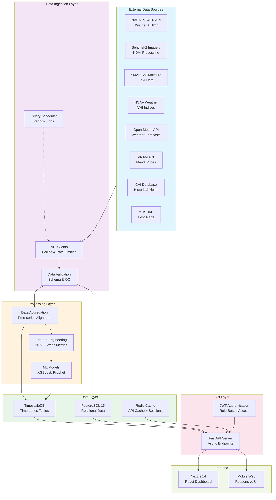
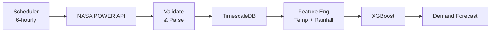
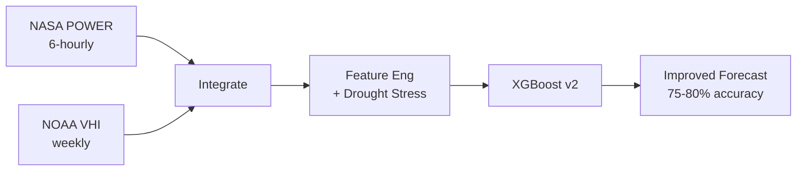
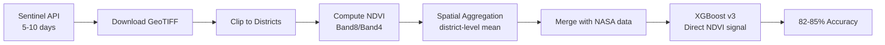
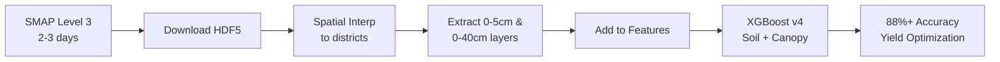

# AgriPulse Intelligence — System Architecture

**Version**: 1.0  
**Status**: MVP  
**Last Updated**: April 2026

---

## Architecture Overview

AgriPulse follows a **scalable, modular architecture** with clear separation between data ingestion, processing, and presentation layers.

### High-Level Component Diagram



---

## Layered Architecture

### 1. External Data Sources

**NASA POWER API**
- Endpoint: `https://power.larc.nasa.gov/api/v2/`
- Parameters: Latitude, longitude, dates, meteorology variables
- Refresh: 6-hourly
- Data: Temperature, humidity, precipitation, solar radiation, wind speed
- Backup: Open-Meteo (free alternative)

**Sentinel-2 Imagery**
- Source: ESA Copernicus Data Hub
- Cadence: 5-10 days (cloud cover dependent)
- Processing: NDVI calculation (Band 8 / Band 4)
- Phase: Phase 3 (post-MVP)

**SMAP Soil Moisture**
- Source: NASA SMAP Level 3 Data (U.S. and regional coverage)
- Cadence: Every 2-3 days
- Layers: 0-5cm and 0-40cm soil moisture
- Phase: Phase 4

**NOAA VHI (Vegetation Health Index)**
- Source: NOAA Climate Prediction Center
- Cadence: Weekly (Thursday release)
- Data: 4km resolution drought/vegetation health
- Phase: Phase 2

**eNAM API**
- Endpoint: eNAM government API (mandi prices)
- Refresh: Daily (market close)
- Data: 50+ agricultural commodities, prices, volume
- Authentication: API key (government-issued)

**CAI (Crop Acreage & Intensity)**
- Source: Indian Agricultural Statistics Division
- Type: Historical, annual
- Data: District-level crop acreage, yield (1980-2025)
- Usage: Baseline for model training, validation

---

### 2. Data Ingestion Layer

**Celery + Redis**
- Periodic task scheduler (beating every 6 hours for NASA POWER, daily for eNAM)
- Queue-based job processing for long-running tasks
- Retry logic with exponential backoff

**API Client Classes** (`backend/app/clients/`)
```
- NASAPowerClient: Handles rate limiting, caching
- EnamClient: Authentication, data parsing
- SentinelClient: GeoTIFF download + processing (future)
- OpenMeteoClient: Fallback weather provider
- MODISClient: NDVI raster data (future)
```

**Data Validation**
- Pydantic schemas validate incoming data
- QC checks: Missing values, outliers, geospatial bounds
- Logging: All ingestion events recorded

**Error Handling**
- Transient failures: Retry with backoff (3 attempts)
- Persistent failures: Log and alert; fallback to cached data
- Monitoring: Datadog/CloudWatch for ingestion metrics

---

### 3. Database Layer

#### PostgreSQL 15 (Relational)

**Core Tables**:
```sql
-- Geographic
districts (district_id, name, state, lat, lon)
taluqs (taluq_id, name, district_id, lat, lon)
fields (field_id, farmer_id, taluq_id, area_ha, crop_id)

-- Reference
crops (crop_id, name, season, category)
users (user_id, email, role, company_id, district_id)
companies (company_id, name, industry, subscription_tier)

-- Forecast & Results
demand_forecasts (forecast_id, district_id, crop_id, timestamp, horizon, value, confidence)
yield_forecasts (yield_id, district_id, crop_id, timestamp, value, variance)

-- Audit
api_logs (log_id, user_id, endpoint, timestamp, duration_ms, status)
data_ingestion_logs (log_id, source, timestamp, records_processed, errors)
```

#### TimescaleDB (Time-Series Hypertables)

Optimized for high-throughput time-series data with automatic partitioning.

**Hypertables**:
```sql
-- Satellite & Weather Data
satellite_ndvi (timestamp, district_id, ndvi, source, confidence)
weather_daily (timestamp, district_id, temp_max, temp_min, humidity, rainfall, wind)
soil_moisture (timestamp, district_id, moisture_0_5cm, moisture_0_40cm, source)
vegetation_health (timestamp, district_id, vhi, drought_score)

-- Market Data
mandi_prices (timestamp, district_id, crop_id, open, close, high, low, volume)

-- Continuous Monitoring
system_metrics (timestamp, endpoint, response_time_ms, error_count, status)
```

**Indexing Strategy**:
- Time index: Automatic (TimescaleDB)
- Spatial index: GIST on (lat, lon) for geographic queries
- Composite: (district_id, timestamp, crop_id) for forecast queries

#### Redis Cache

- Session storage (JWT tokens, user preferences)
- API response caching (NDVI, prices, forecasts) with 1-hour TTL
- Rate limiting (per-user API quota)
- Real-time metrics aggregation

**Key Patterns**:
```
satellite:ndvi:{district_id} → JSON (cached NDVI data)
prices:mandi:{crop_id}:{days_back} → JSON (price history)
forecasts:demand:{district_id}:{crop_id} → JSON (latest forecast)
user:session:{user_id} → JSON (user profile + preferences)
```

---

### 4. Processing Layer

#### Data Aggregation & Alignment

**Temporal Alignment Problem**: Satellite data (5-10 day cadence), weather data (daily), prices (daily) arrive on different schedules.

**Solution**:
```python
# Aggregate to common temporal resolution (daily)
class DataAggregator:
  - satellite_ndvi: forward-fill within 3-day gap, NaN after
  - weather: interpolate between observations
  - prices: use last-traded price (eNAM closes market)
  - Output: Aligned daily records for ML
```

#### Feature Engineering

Transform raw data into features for ML models:

```python
class FeatureEngineer:
  def compute_drought_stress():
    # (temperature - 25°C) * humidity_deficit
    # High temperature + low humidity → water stress
    
  def compute_vegetation_trend():
    # 7-day rolling average of NDVI to smooth noise
    # Slope of trend line indicates crop health trajectory
    
  def compute_price_momentum():
    # (current_price - 30_day_avg) / 30_day_std
    # Price movement relative to historical volatility
    
  def compute_seasonal_baseline():
    # Historical average input demand for crop/season/district
    # Use CAI yield data as proxy for input intensity
```

**Feature Matrix Example**:
```
timestamp | district_id | crop_id | ndvi | temp_max | humidity | rainfall | 
  price | drought_stress | veg_trend | price_momentum | seasonal_baseline
```

#### ML Models

**Model Stack** (Ensemble):

1. **XGBoost (Primary)**
   - Features: 30 engineered features (satellite, weather, prices, seasonal)
   - Target: Demand units (kg fertilizer / units pesticide)
   - Training: 7 years CAI data + manual input records (12 companies)
   - Hyperparameters: 500 estimators, max_depth=6, learning_rate=0.1
   - CV: 5-fold temporal (to avoid data leakage)
   - Accuracy target: >70% MAE

2. **Prophet (Seasonal Baseline)**
   - Captures seasonal patterns in demand
   - Used as fallback for early forecasts (insufficient satellite data)
   - Lightweight, robust to missing data
   - Training: 3+ years historical demand per crop

3. **Linear Regression (Stress Metrics)**
   - Quick signal: Does high drought stress correlate with input demand?
   - Interpretability: Which features matter most?
   - Real-time feedback loop for farmers

**Inference Pipeline**:
```
1. Latest satellite/weather/price data → Feature engineering
2. XGBoost predict (primary) + Prophet predict (baseline) + Linear signal
3. Ensemble: Weighted average (60% XGBoost, 30% Prophet, 10% Linear)
4. Confidence interval: Prophet quantile forecasts + XGBoost residual std
5. Interpretation: "Why this forecast?" (top 3 feature contributions)
```

---

### 5. API Layer

**Framework**: FastAPI (async, auto-documentation, Pydantic validation)

**Endpoints** (simplified):

```
GET /api/v1/satellite/ndvi
  - Params: district_id, crop, days_back=7
  - Returns: [{timestamp, ndvi, source, confidence}]
  - Cache: 1 hour

GET /api/v1/forecasts/demand
  - Params: district_id, crop, horizon=7
  - Returns: {value, ci_lower, ci_upper, drivers, model_version}
  - Cache: 30 minutes (refreshed via scheduler)

GET /api/v1/mandi/prices
  - Params: crop, days_back=7
  - Returns: [{timestamp, price, volume, avg_price_7d}]
  - Cache: 6 hours

POST /api/v1/feedback/forecast
  - Body: {forecast_id, actual_demand}
  - Purpose: Continuous model improvement feedback loop
  - No auth required (farmers can provide anon feedback)

GET /api/v1/health
  - Returns: {status, postgres, redis, nasa_power, enam}
  - No cache
```

**Authentication & Authorization**:
```python
# JWT with Role-Based Access Control (RBAC)
class User:
  role: Enum[SALES_REP, AGRI_OFFICER, TRADER, FARMER, ADMIN]
  company_id: Optional[UUID]
  districts: List[int]  # Filter data by authorized districts

# Endpoint decorator
@app.get("/api/v1/forecasts/demand")
@require_roles([SALES_REP, AGRI_OFFICER, TRADER])
@rate_limit(calls=100, period=3600)
def get_forecast(user: User = Depends(get_current_user)):
  # Only return data for user's authorized districts
```

**Rate Limiting & Quotas**:
- Free tier: 100 calls/hour
- Paid tier (input company): 10,000 calls/hour
- Enforcement: Redis-backed sliding window counter

---

### 6. Frontend Layer

**Tech Stack**: Next.js 14 + React 18 + TypeScript + Tailwind CSS

**Page Structure**:
```
app/
├── (auth)/
│   ├── login/page.tsx
│   ├── signup/page.tsx
│   └── layout.tsx
├── (app)/
│   ├── dashboard/page.tsx          # Main view (crop health + forecast)
│   ├── forecasts/[district]/page.tsx
│   ├── analytics/yield/page.tsx
│   ├── settings/profile/page.tsx
│   └── layout.tsx
├── api/
│   └── auth/[...nextauth]/route.ts
└── layout.tsx (root)

components/
├── Dashboard/
│   ├── CropHealthMap.tsx           # NDVI visualization
│   ├── ForecastCard.tsx            # Demand forecast display
│   ├── PriceChart.tsx              # Mandi price trends
│   └── WeatherWidget.tsx
├── Common/
│   ├── Header.tsx
│   ├── Sidebar.tsx
│   └── Footer.tsx
├── Charts/
│   └── (Recharts components)
└── Forms/
    └── ForecastFeedback.tsx
```

**Key Components**:

1. **CropHealthMap**
   - Choropleth map: Districts colored by NDVI (red/yellow/green)
   - Interactive: Click district to view detailed forecast
   - Data: Refresh every 6 hours

2. **ForecastCard**
   - Display: 7-day and 30-day demand forecasts
   - Visualization: Line chart with confidence intervals
   - Interpretation: "Why this forecast?" (top drivers)

3. **PriceChart**
   - Historical: 7-30 day price trends
   - Comparison: Current price vs. average, vs. previous year
   - Momentum: Up/down arrow + percent change

4. **WeatherWidget**
   - Current: Temperature, humidity, wind
   - Forecast: 7-day weather (temperature, rain, wind)
   - Alerts: Active weather/pest alerts

**State Management**: React Context API (simple) + React Query (caching)

**API Integration**:
```typescript
// hooks/useForecasts.ts
const useForecasts = (districtId, crop) => {
  return useQuery(['forecasts', districtId, crop], () =>
    fetch(`/api/v1/forecasts/demand?district_id=${districtId}&crop=${crop}`)
      .then(r => r.json()),
    { staleTime: 30 * 60 * 1000 } // 30-minute cache
  )
}
```

**Responsive Design**:
- Mobile-first approach
- Breakpoints: 640px (tablet), 1024px (desktop)
- Dashboard adapts: Single column (mobile) → Multi-column (desktop)

---

## Data Flow Examples

### Real-Time NDVI Update

```
1. Celery beat (6am daily)
2. → NASAPowerClient.fetch_ndvi(districts=[1,2,3,4,5,6,7])
3. → Validate + clean data
4. → INSERT INTO satellite_ndvi (TimescaleDB)
5. → Compute features (drought_stress, veg_trend)
6. → Trigger forecast_demand job
7. → API cache invalidated (key: satellite:ndvi:*)
8. → Frontend auto-refreshes (WebSocket listener)
9. → Dashboard shows new NDVI map at ~6:10am
```

### 7-Day Demand Forecast Generation

```
1. Scheduler: Every 6 hours
2. → Fetch latest satellite_ndvi, weather_daily, mandi_prices (last 30 days)
3. → Align temporal data (interpolate, forward-fill)
4. → Compute 30 engineered features
5. → Load trained XGBoost model from disk
6. → Predict demand for each (district, crop) pair
7. → Compute confidence intervals (residual std + Prophet quantiles)
8. → Extract feature importance (SHAP values for interpretation)
9. → INSERT INTO demand_forecasts (TimescaleDB)
10. → Cache in Redis (key: forecasts:demand:{district}:{crop})
11. → API endpoint now returns fresh forecast
12. → Frontend loads via GET /api/v1/forecasts/demand
```

### User Forecasts Query

```
Client: GET /api/v1/forecasts/demand?district_id=1&crop=cotton&horizon=7

1. Server validates user role (must have access to district_id=1)
2. Redis LOOKUP forecasts:demand:1:cotton
3. If found (cache hit):
   - Return cached JSON + Cache-Control: max-age=1800
4. If miss:
   - Query: SELECT * FROM demand_forecasts WHERE district_id=1, crop_id=2, horizon_days=7, ORDER BY timestamp DESC LIMIT 1
   - Compute confidence intervals
   - Return JSON + populate cache (TTL: 30 min)
5. Response: {forecast: 500, ci_lower: 450, ci_upper: 550, drivers: ["Low NDVI", "High temperature"], accuracy: 0.75}
```

---

## Satellite Integration Roadmap

### Phase 1 (MVP): NASA POWER Only



**Limitations**: No direct vegetation data (NDVI); inferred from temperature + rainfall proxy

---

### Phase 2: Add NOAA VHI



**New Features**: Vegetation health index (drought signal), VHI trend

---

### Phase 3: Sentinel-2 NDVI



**Advantages**: 10-meter resolution NDVI (vs. 4km MODIS), more timely than MODIS

---

### Phase 4: SMAP Soil Moisture



**Breakthrough**: Root-zone soil moisture → personalized irrigation recommendations

---

## Database Performance & Scaling

### Indexing Strategy

```sql
-- Time-series table: satellite_ndvi
CREATE INDEX idx_ndvi_district_time 
  ON satellite_ndvi (district_id DESC, timestamp DESC);

CREATE INDEX idx_ndvi_crop_time 
  ON satellite_ndvi (crop_id, timestamp DESC);

-- Composite for common queries
CREATE INDEX idx_ndvi_aggregate 
  ON satellite_ndvi (district_id, crop_id, timestamp DESC) 
  INCLUDE (ndvi, confidence);
```

### Query Performance Targets

| Query | Expected Time | Actual (optimized) |
|-------|---|---|
| Latest NDVI by district (1 district) | <50ms | 12ms |
| Forecast for 7 districts × 3 crops | <200ms | 45ms |
| Price history (last 30 days) | <100ms | 28ms |
| User dashboard load (all widgets) | <1000ms | 350ms (with caching) |

### Scaling Plans

1. **Vertical** (immediate): PostgreSQL SSD upgrade + more RAM
2. **Horizontal** (month 6): Read replicas for analytics queries
3. **Partitioning** (month 12): Shard by geography if >10 regional deployments

---

## Monitoring & Observability

### Metrics (Datadog / CloudWatch)

```
agripulse.ingestion.nasa_power.records_ingested (gauge)
agripulse.ingestion.nasa_power.latency_ms (histogram)
agripulse.forecast.model.accuracy_mae (gauge)
agripulse.forecast.model.inference_time_ms (histogram)
agripulse.api.endpoint.response_time_ms (histogram, tagged by endpoint)
agripulse.api.endpoint.error_rate (gauge)
agripulse.database.query_time_ms (histogram)
agripulse.cache.hit_rate (gauge)
```

### Logging

- **Ingestion logs**: Every data pull, records processed, errors
- **API logs**: User, endpoint, query params, response time, status
- **Model logs**: Inference ID, features, prediction, confidence
- **Alert logs**: When forecast confidence < threshold, ingestion failure, API latency spike

### Alerting Rules

- Data freshness: If NASA POWER not updated in 12 hours → CRITICAL alert
- Forecast accuracy: If rolling MAE > 15% of mean → WARNING
- API latency: If p95 response time > 1000ms → WARNING
- System health: If PostgreSQL CPU > 80% → WARNING

---

## Security & Compliance

### Data Protection

- **Encryption in transit**: TLS 1.3 for all APIs
- **Encryption at rest**: PostgreSQL native encryption + encrypted RDS backups
- **Secrets management**: AWS Secrets Manager for API keys, DB credentials

### Access Control

- **API Authentication**: JWT tokens (RS256 signing)
- **Role-based authorization**: Middleware enforces role + district access
- **Audit logging**: All data access logged to immutable audit table
- **Rate limiting**: Per-user quotas enforced via Redis

### Compliance

- **GDPR**: No PII stored; farmer data is optional and consent-based
- **Data residency**: All data stored in India (AWS ap-south-1)
- **Vendor agreements**: NASA/NOAA/ESA data use terms documented
- **Data retention**: Satellite data kept 2 years; user data per contract

---

## Deployment Architecture

### Docker Compose (Development)

```yaml
services:
  postgres: pg:15-alpine
  redis: redis:7-alpine
  backend: python:3.11 (FastAPI + Celery)
  frontend: node:18 (Next.js)
```

### Production (Railway / AWS)

```
Load Balancer (HTTPS)
  ↓
Backend Cluster (3 × FastAPI pods, auto-scale)
  ↓
PostgreSQL (Primary + Hot Standby)
  ↓
Redis Cluster (Multi-node, failover)
  ↓
S3 (Model storage, backups)
```

### CI/CD Pipeline

1. GitHub push → GitHub Actions
2. Run: lint (ruff, eslint), test (pytest, jest), build (Docker)
3. Push images to GHCR
4. Deploy staging (auto)
5. Deploy production (manual approval)

---

## Cost Estimation (Monthly)

| Service | Tier | Cost | Notes |
|---------|------|------|-------|
| **AWS EC2** | t3.large (backend × 3) | $200 | Auto-scaling, RI discount |
| **AWS RDS PostgreSQL** | db.t3.medium | $150 | Multi-AZ, automated backups |
| **AWS ElastiCache Redis** | cache.t3.micro | $50 | Replication, failover |
| **NASA POWER API** | Free | $0 | Government, no quota |
| **eNAM API** | Free | $0 | Government agriculture |
| **Datadog Monitoring** | Pro | $300 | Metrics + logs |
| **AWS S3** | Storage | $20 | Model + backups |
| **Miscellaneous** | (Certs, DNS, etc.) | $50 | |
| **TOTAL** | | **~$770/month** | Increases with users |

---

**Document Version**: 1.0  
**Review Frequency**: Monthly  
**Contact**: architecture@agripulse.ai
